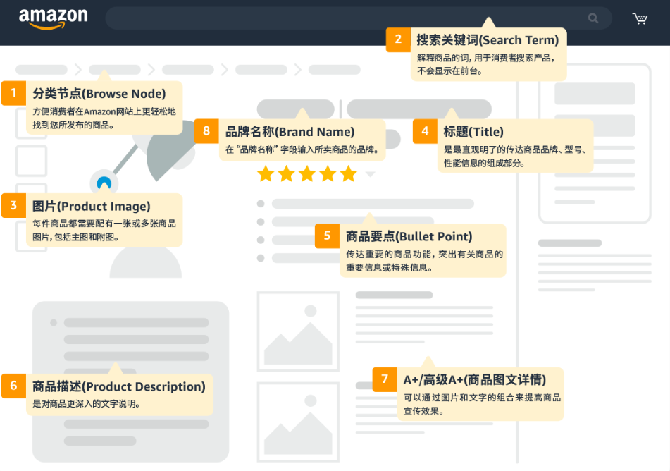

# **一、Listing概述**

## **1.1什么是Listing**

在亚马逊这个全球电商巨头的平台上，每一个卖家的产品都有一个专属的页面，这个页面被称为“Listing”。Listing就是商品详情页，是消费者了解某个商品的最直接途径。每当卖家将商品上传到亚马逊，系统会自动为该商品创建一个Listing页面。这些页面为消费者提供了所有关于商品的详细信息，无论是产品的基本功能、使用方法，还是产品的外观和特性。对于卖家来说，Listing不仅是展示商品的舞台，也是与消费者沟通的桥梁。通过优化Listing，卖家可以更好地吸引潜在顾客，提升商品的曝光量和销量。

Listing的构成并非仅仅是一个简单的商品展示页面。它包含了多个关键部分，这些部分共同作用，帮助消费者全面了解商品，进而做出购买决策。在亚马逊平台上，Listing的基本组成要素有八个，它们分别是分类节点（Browse Node）、搜索关键词（Search Term）、商品图片（Product Image）、商品标题（Title）、商品要点（Bullet Points）、商品描述（Product Description）、A+内容（A+ Content）、品牌名称（Brand Name）。这些要素并非孤立存在，而是紧密联系，协同工作，共同决定着一个Listing的表现。

每一部分的作用各有不同，但都至关重要。例如，分类节点帮助消费者在寻找商品时快速找到目标产品，搜索关键词则帮助商品在搜索结果中获得更高的曝光，而商品图片则是第一时间吸引顾客目光的关键。通过合理安排每一项内容，卖家可以确保他们的Listing能够在竞争激烈的市场中脱颖而出，吸引到更多的点击和购买。以下即是8个基本要素的简要介绍：

### **1.1.1分类节点（Browse Node）**

分类节点是Listing中的第一个关键组成部分。它决定了产品被放置在哪个大类或者子类下。亚马逊通过分类节点帮助消费者快速找到所需商品，因此，分类节点不仅影响了商品的曝光度，也直接影响了消费者的购买决策。分类节点的选择必须精确而准确，能够全面覆盖商品的特性及潜在买家所在的兴趣圈层。

例如，一款户外背包的Listing应当放在“户外”这一大类下，同时在“背包”这一子类中进行进一步细化。如果分类节点选择不当，商品可能会被归类到不相关的类别中，从而降低商品的曝光度，甚至让目标消费者完全无法找到它。因此，正确选择分类节点是Listing优化中的第一步，尤其对于新品来说，准确的分类能够帮助卖家迅速进入目标市场。

### **1.1.2搜索关键词（Search Term）**

搜索关键词是另一个至关重要的元素。消费者通过搜索关键词来查找他们感兴趣的商品，而卖家则通过在Listing中填入相关的搜索词来增加商品的曝光机会。通过亚马逊的后台工具，卖家可以设置与商品相关的搜索关键词。这些关键词不仅包括商品的核心特征，还应该涵盖消费者可能使用的其他相关词汇。

例如，卖家销售的产品可能是“防水运动手表”，那么与其相关的关键词可能包括“防水手表”、“运动手表”、“户外手表”等。如果卖家只使用了“运动手表”这一单一关键词，可能会错失潜在顾客，因为顾客可能会使用不同的词汇来搜索相同的商品。因此，卖家应该通过市场调研和竞争分析，选择最相关的关键词，并将它们合理分布在Listing的各个部分，确保商品能够被精准地找到。

### **1.1.3商品图片（Product Image）**

商品图片是消费者在线购物时对商品的第一印象。由于亚马逊是一个以图片为主的电商平台，商品图片直接影响到消费者是否愿意点击查看Listing。对于每个商品，主图应当展示商品最具代表性的外观，例如产品的整体形态、颜色、尺寸等。如果商品有多个颜色或款式，可以通过副图展示其不同的样式、尺寸或使用场景。

一个高质量的商品图片可以显著提升消费者对商品的兴趣，增强他们的购买欲望。卖家需要确保图片清晰、真实且具有吸引力。此外，副图应当展示商品的细节、功能和使用场景，帮助消费者全面了解商品。如果产品是需要进行组装或具有复杂功能的，副图还可以展示产品的使用步骤或效果。总之，商品图片是吸引点击、提高转化率的关键。

### **1.1.4商品标题（Title）**

商品标题是Listing中最重要的信息之一。它是消费者在搜索结果中看到的第一部分，也是吸引点击的关键。商品标题应当简洁而有力，能够准确传达商品的关键信息，同时避免过度堆砌关键词。一个理想的商品标题通常包括品牌名称、商品类别、产品的核心功能或特征，并适当融入目标关键词。

例如，“防水户外运动手表”可能不如“户外防水运动手表-适用于游泳、跑步、登山-蓝色”更具吸引力。通过这个标题，消费者不仅能看到品牌信息、功能和适用场景，还能清晰了解产品的独特卖点。标题需要突出商品的核心优势，同时避免使用过长或不相关的描述。

### **1.1.5商品要点（Bullet Points）**

商品要点部分（即我们所耳熟的五点描述）是Listing中另一关键的组成部分。通过简洁的要点，卖家可以列出商品的主要特点和优势，帮助消费者快速了解商品。商品要点应简洁明了，着重突出商品的功能、质量、材质、适用场景等关键信息。每一个要点都是一次与消费者沟通的机会，它决定了消费者是否继续深入查看商品。例如，对于一款背包，商品要点可以包括：防水设计、大容量、多功能口袋、耐用拉链、舒适肩带等。通过这种简洁而有针对性的描述，卖家能够清晰传达产品的核心优势，并吸引消费者的注意。

### **1.1.6商品描述（Product Description）**

商品描述部分为Listing提供了更为详细的内容，是卖家向消费者传达商品独特卖点的重要渠道。商品描述通常包含了产品的背景信息、使用方法、材质、保养技巧等内容，帮助消费者全面了解商品。描述语言应简洁、清晰，同时融入情感因素，增强消费者的购买欲望。

商品描述的长度应适中，过长可能导致消费者失去耐心，而过短则可能让消费者对商品产生疑虑。卖家在撰写商品描述时，应该尽可能详细且富有吸引力，涵盖商品的所有重要信息，并且针对不同的目标消费者群体进行调整。

### **1.1.7A+内容（A+ Content）**

A+内容是亚马逊平台为卖家提供的额外展示功能，可以让卖家在商品页面上增加更多的图文内容，提升商品的专业度和吸引力。A+内容通常包括品牌故事、产品详细介绍、更多的图片和图表等。通过A+内容，卖家能够将商品的卖点更加生动地呈现给消费者，同时提升品牌形象。

A+内容是提升销量和品牌认知度的重要工具，尤其对于那些在市场上具有竞争力的卖家来说，它能够帮助商品从众多同类商品中脱颖而出。通过优化A+内容，卖家可以增加消费者的购买信心，进而推动销量的增长。

### **1.1.8品牌名称（Brand Name）**

品牌名称是Listing的重要组成部分，它直接影响消费者对商品的认知和信任。强大的品牌能够为商品增加附加值，让消费者对商品产生更高的信任感。对于那些新兴品牌或没有知名度的卖家来说，品牌名称的呈现更为重要，能够帮助他们逐步建立市场认知度。

总结来说，Listing不仅是卖家展示商品的窗口，更是与消费者建立信任、传递商品价值的桥梁。通过优化Listing的各个要素，卖家能够提升商品的曝光量和转化率，实现销量的稳步增长。

## **1.2为什么要重视Listing**

**Listing是亚马逊平台上商品展示和销售的基础，直接决定了商品的能见度和销量：**

对于卖家而言，Listing不仅是一个简单的商品介绍页面，更是吸引消费者点击、了解、并最终购买商品的关键。由于电商平台上的购物体验与传统零售有所不同，消费者无法亲自接触商品，无法触摸、感知商品的实际品质，因此，所有关于商品的关键信息都必须通过Listing来呈现。商品的每个细节都通过文字、图片、视频等多种方式展示，帮助消费者做出购买决策。如果Listing内容不完整、描述不清晰或信息不准确，消费者可能无法找到该商品，甚至对其产生疑虑，最终放弃购买。

**首先，Listing是卖家与消费者之间的主要沟通渠道：**

消费者在决定购买之前，需要从Listing中获取关于产品的所有信息，包括产品的特点、尺寸、用途、材料、品牌等。如果某个产品的Listing写得不清晰或者缺乏吸引力，消费者很可能错过该商品，转而选择其他更具吸引力的商品。这种情况下，即使商品本身具有很高的质量和性价比，也可能因为Listing的质量问题而错失销售机会。而一个高质量的Listing不仅能提供清晰且全面的信息，还能吸引消费者停留在页面，进一步浏览其他详情，并最终促成购买。

**其次，Listing的质量直接关系到商品的曝光量：**

亚马逊作为一个全球最大的电商平台，其搜索引擎和推荐算法在商品展示中起着至关重要的作用。消费者通常通过关键词搜索自己需要的商品，Listing中的标题、描述、关键词等内容的设置，都会影响商品的搜索排名和曝光量。一个优化良好的Listing可以让商品在搜索结果中排名靠前，获得更多的点击机会。而一个没有经过优化的Listing，可能会因为没有包含相关关键词，或者关键词设置不当而无法被消费者找到，甚至被淹没在成千上万的商品中。因此，Listing不仅仅是一个商品页面，更是商品在亚马逊搜索引擎中排名的重要因素。

**此外，Listing还承担着增强消费者信任的功能：**

在亚马逊这样的跨境电商平台上，消费者与卖家的交易大多是远程完成的，消费者无法亲自检查商品的质量或性能。因此，Listing中的详细信息和高质量的展示，能够帮助消费者建立对商品的信任感。比如，清晰的产品图片、多角度的展示、详细的使用方法和说明，可以帮助消费者更好地理解商品的价值，从而提高他们的购买意愿。而在竞争激烈的市场中，消费者往往更倾向于选择那些详细、真实、有吸引力的商品页面。因此，精心设计和优化的Listing有助于提升品牌形象，增强消费者对卖家的信任感。

**Listing不仅是商品展示的页面，更是跨境电商卖家进入新市场的第一步：**

在全球化的电商平台上，卖家需要考虑不同市场的需求差异以及文化差异，针对每个市场进行定制化的Listing优化。一个适应目标市场需求的Listing，能够有效吸引该市场的消费者，提升商品的销量。如果没有经过优化的Listing，卖家可能会因为没有针对性地调整标题、描述、关键词等元素，错失进入新市场的机会。此外，跨境卖家还需要关注Listing是否符合当地的法规和规定，以确保商品能够顺利上架并进行销售。

## 1.3给读者的建议

综上1.1和1.2部分所述，Listing不仅是一个简单的商品展示页面，它承载着商品所有的关键信息，是消费者了解和购买商品的唯一渠道。Listing的质量直接影响商品的曝光量、消费者的信任度以及最终的销量。卖家如果忽视了Listing的优化，不仅会错失销售机会，还可能导致商品无法被潜在买家找到。因此，重视Listing并做好它的每一项内容，对卖家的销售和品牌建设至关重要。

于此同时，Listing的每一部分都在消费者的购买决策中扮演着重要角色。因此，卖家在创建Listing时需要从多个维度进行优化。首先，在标题和关键词的选择上，卖家应当进行充分的市场调研，选择与产品高度相关并且具有高搜索量的词汇。同时，避免堆砌无关词汇，保持标题简洁明了，突出商品的核心卖点。

其次，在商品描述和商品要点的编写上，卖家要特别注意条理清晰，突出商品的优势和独特之处。描述要避免长篇大论，最好通过简洁的语言把握住消费者的兴趣点，并且切实解决消费者的痛点。此外，卖家还应确保商品图片的质量和数量，以便让消费者通过视觉直观地了解商品的各个方面，增强他们的购买信心。

最后，卖家可以通过亚马逊的A+内容功能提升品牌形象，增加产品的附加值。通过专业的品牌呈现，卖家能够在竞争激烈的市场中脱颖而出，提升品牌的知名度和消费者的忠诚度。

总之，优化Listing是一个长期的过程，需要不断根据市场的变化、消费者的需求和竞争情况进行调整。卖家应当不断学习、研究市场动态，并通过数据分析来指导Listing的优化工作。同时，借助像DeepBI这样的智能工具，卖家可以通过数据驱动的方式优化广告投放，提高产品的曝光和转化率，实现长期稳定的业绩增长。