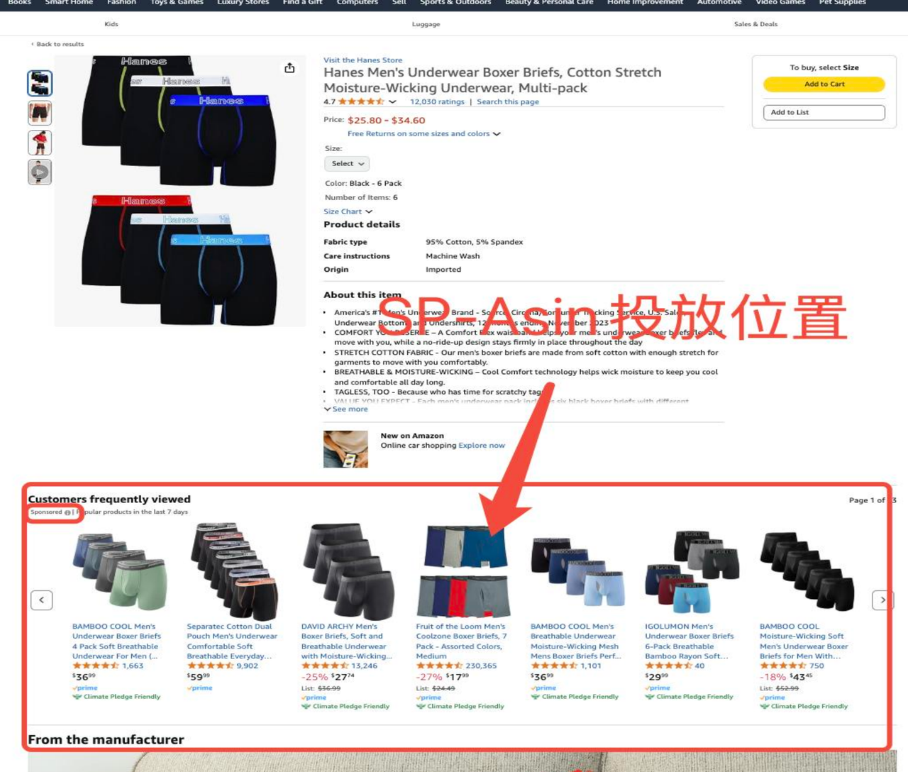
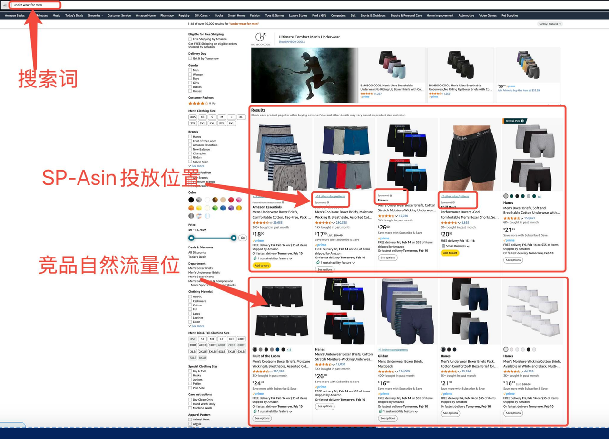

### 2.2.1亚马逊广告的三种类型

亚马逊广告体系主要包括以下几种广告形式：

-   **商品推广广告（** **Sponsored Products** **，** **SP** **广告）** ：这是亚马逊最基础且最常见的广告形式，卖家可以通过它在搜索结果中将自己的产品推荐给潜在客户。SP广告的核心是通过关键词或自动匹配来触发广告，广告展示在搜索结果页或者商品详情页。
-   **品牌推广** **广告（Sponsored Brands，SB广告）** ：SB广告允许卖家将品牌的多个产品展示在同一广告位中，通常出现在搜索结果页面的顶部或底部。它不仅提升了品牌的曝光度，还帮助卖家推广多个产品，吸引更多的顾客。
-   **展示广告（** **Sponsored Display** **，** **SD** **广告）** ：这种广告形式在亚马逊平台外的其他网站和应用程序中展示，可以帮助卖家吸引到那些曾经浏览过他们产品的潜在客户，增强再营销效果。

#### 2.2.1.1广告投放模式概述

在亚马逊广告的生态系统中，SP广告无疑是最常用且最具影响力的一种广告形式。它不仅是亚马逊平台上最基础、最普遍的广告投放形式，也是商家常常依赖的广告策略之一。根据最新的行业数据，SP广告常年在亚马逊广告销售中占据主导地位，约贡献70%至80%的广告销售额。对于商家而言，SP广告也最为方便好用。投放亚马逊SP广告的产品，将遍布搜索结果页和产品详情页，更加容易被亚马逊平台用户的点击和购买。

在亚马逊广告的生态系统中，除了大多数买家视为首选且最具影响力的SP广告，SB广告和SD广告也是非常重要的广告形式，各自有着其独特的作用和优势。为了帮助读者全面了解亚马逊广告的多样性，本书将重点讲解商品推广广告（SP）的运作方式，并将对品牌推广广告（SB）和展示广告（SD）两种广告类型进行简要介绍。本书部分旨在通过聚焦于它们的基本投放方式和特点，帮助卖家读者更好地理解这三类广告形式进而能够更好在广告运营实践中分析制定合理高效的策略。

#### 2.2.1.2商品推广广告（SP）

SP广告投放形式则又主要包括**自动广告（AUTO）** 、**手动广告（MANU）以及ASIN广告投放**三种方式。每种方式都有其独特的特点、优势以及适用场景，卖家可以根据实际需求选择不同的广告模式进行投放。

1.  ##### **AUTO广告投放方式**

自动广告（AUTO）是一种由亚马逊系统自动匹配关键词和广告展示位置的广告投放方式。卖家只需提供产品信息，系统会根据产品特性、市场需求以及客户行为数据来选择合适的关键词并展示广告。AUTO广告的优势在于其自动化程度高，卖家不需要过多的手动设置和调整，适合初期投放和数据收集。

**AUTO广告的关键词拓展方式：** AUTO广告的关键词拓展主要通过亚马逊的自动匹配算法来完成。系统会根据产品的特性和客户搜索的相关性，自动选择关键词并展示广告。具体的拓展方式包括：

-   **紧密匹配（Close Match）** ：该模式下，系统会选择与产品最为相关的关键词进行匹配。例如，如果卖家销售的是“蓝牙耳机”，系统可能会选择“无线耳机”或“蓝牙耳机”作为紧密匹配的关键词。紧密匹配的关键词通常与产品的功能、特点高度契合，因此可以带来较高的点击率和转化率。
-   **宽泛匹配（Loose Match）** ：该模式下，系统会选择一些与产品相关性较低但仍然与顾客兴趣相关的关键词进行匹配。例如，系统可能会为“蓝牙耳机”选择与之不完全相关的关键词，如“音响”或“耳机”，这些关键词的匹配范围更广，但可能带来较低的转化率。
-   **同类商品匹配（Substitutes）** ：该模式下，广告将展示给那些搜索与卖家产品功能相似的商品。例如，如果顾客搜索了“蓝牙耳机”，系统可能会展示其他品牌或款式的耳机广告，以实现同类商品的匹配。
-   **互补商品匹配（Complements）** ：该模式下，广告展示给那些搜索与卖家产品互补的商品。例如，顾客购买“蓝牙耳机”时，系统可能会推送相关的蓝牙配件或耳机保护套等商品广告。

2.  ##### **MANU广告投放方式**

手动广告（MANU）则由卖家手动选择关键词并进行广告投放。相比于AUTO广告，MANU广告允许卖家对广告投放进行更加精细的控制，适合那些对广告投放有较高要求的卖家。卖家可以选择精准的关键词，并控制广告的预算、出价等，以确保广告的投放更具针对性。

**MANU广告的关键词匹配方式：** MANU广告的关键词匹配方式有三种，分别是精确匹配（Exact Match）、短语匹配（Phrase Match）和广泛匹配（Broad Match）。每种匹配方式都有不同的特点，卖家可以根据目标受众和广告效果选择最合适的方式。

-   **精确匹配**：精确匹配是最严格的匹配方式，只有当顾客的搜索词与卖家选择的关键词完全一致时（在英文中，仅允许单复数和ing等简单的变体形式），广告才会显示。例如，如果卖家选择“蓝牙耳机”作为精确匹配关键词，那么只有当顾客搜索“蓝牙耳机”时，广告才会展示。精确匹配带来的流量通常更精准，转化率也更高，但展示机会即曝光量相对较少。
-   **短语匹配**：短语匹配允许顾客搜索包含选定关键词短语的任何查询（顺序也应保持一致）。例如，如果卖家选择“蓝牙耳机”作为短语匹配关键词，那么顾客搜索“无线蓝牙耳机”或“便携蓝牙耳机”时，广告也会展示。短语匹配的流量范围较精确匹配广，但仍能保证广告与顾客搜索的相关性。
-   **广泛匹配**：广泛匹配是最宽松的匹配方式，广告将展示给所有与选定关键词相关的搜索词。例如，选择“蓝牙耳机”作为广泛匹配关键词，则广告可能会展示在买家用户搜索“耳机”，“无线音响”或“耳机蓝牙”等相关搜索词时。广泛匹配的优势在于流量覆盖面广，但转化率相对较低。

3.  ##### **ASIN广告投放方式**

ASIN广告投放方式是亚马逊广告中的一个独特模式，其主要选择从两个位置投放商品广告，分别是：

-   竞品详情页下方的广告位：竞品详情页下方广告位，此广告位的逻辑在于当用户浏览竞品商品时，亚马逊会在页面底部推荐与本商品即竞品相关的广告，这能够流量精准拦截提供绝佳的机会。若投放广告的产品在综合方面优于竞品，则可实现对竞品的流量拦截。

-   关键词搜索结果页面的广告位：即用户主动搜索后展示的广告位。

**ASIN广告的定位方式：** ASIN广告投放方式通常适用于希望在与特定商品竞争时进行投放的情况。ASIN广告的定位方式主要有两种：精确定位和拓展定位。

-   **精确定位（Exact Targeting）** ：精确定位意味着广告只会投放给与特定ASIN高度相关的产品的详情页或搜索页中。例如，卖家可以选择某个竞争对手的ASIN作为精确目标，以便将广告展示给正在浏览该产品的顾客。精确定位的优势在于广告投放非常精准，能够锁定竞争对手的顾客群体。
-   **拓展定位（Broad Targeting）** ：拓展定位则允许广告展示给与选定ASIN相似或相关的其他商品的详情页或搜索页中。例如，卖家可以选择iPhone15的ASIN并将其广告投放到华为手机的详情页或是搜索页面上。拓展定位的优势在于能够扩大广告的展示范围，从而获得更多曝光。

#### 2.2.1.4品牌推广广告（SB）

SB广告主要是通过提升品牌曝光，帮助商家增加品牌的认知度，并最终推动销量增长。与SP广告相比，SB广告有一个显著的区别，它能够展示多个产品，而不仅仅是单一的商品。因此，SB广告不仅可以增加单个产品的曝光量，还能在顾客心中留下品牌印象，进一步提高品牌影响力。SB广告主要有三种常见的展示格式，分别是商品集广告（Product Collection）、旗舰店广告（Store Spotlight）以及视频广告（Video Ads）。通过这三种广告格式，SB广告能够帮助卖家提升品牌曝光度和产品的认知度，尤其适用于注重品牌塑造的商家。无论是通过展示多个相关产品，还是通过精心设计的品牌故事，SB广告都能在不同层面上帮助卖家吸引潜在顾客。

-   **商品集广告：** 商品集广告允许卖家在一个广告中展示多个相关产品，而不是单个产品。这种广告格式非常适合那些拥有多个品类或者想要推广多款产品的卖家。通过这种广告，卖家能够将自己品牌的产品一次性展示给潜在顾客，从而提升品牌的整体曝光度。
-   **旗舰店广告：** 旗舰店广告能够引导顾客访问卖家的品牌旗舰店页面。这种广告能够集中展示品牌的核心产品、品牌故事以及其他相关的营销内容，旨在提升品牌的权威性和吸引力。通过旗舰店广告，顾客能够了解品牌的完整产品线，并且进行更多的品牌互动。
-   **视频广告：** 视频广告是通过生动的动态画面和声音来向顾客展示产品特点和品牌理念。这种广告格式特别适合用来增强顾客对产品的兴趣，并帮助品牌传递更多的情感和故事。视频广告能够提供更高的参与度，帮助品牌在顾客中留下深刻的印象。

#### 2.2.1.3展示广告（SD）

SD广告作为亚马逊为卖家提供的另一种广告形式，旨在通过广告展示来提高产品曝光，尤其是在顾客浏览了相关产品后，利用再营销策略将广告推送给潜在顾客。SD广告不局限于搜索结果页，而是通过展示广告在亚马逊平台外的多种位置展示，包括产品详情页、购物车页面等。相比于SP、SB广告的被动投放，客户搜索时才会展示给客户；而SD广告是主动展示广告，可以通过分析用户行为，主动在亚马逊站内外展示给客户的广告方式。SD广告主要有两种投放类型：受众投放（Audience Targeting）和商品投放（Product Targeting）。

-   **受众投放：** 受众投放允许卖家通过顾客的行为数据来定向广告投放。通过这种方式，卖家可以将广告展示给曾经浏览过相关产品或具有潜在购买意图的顾客。受众投放可以通过精准的客户数据提高广告的相关性，从而增加转化率。受众投放的工作机制基于亚马逊庞大的用户数据体系，广告会根据顾客的浏览历史、购买偏好等信息进行智能推送。卖家可以利用这些数据来优化广告展示，提高广告的精准性，并降低无效流量的浪费。
-   **商品投放：** 商品投放是另一种主要的SD广告投放方式，卖家可以通过选择特定的商品进行广告定向展示。通过这种方式，卖家能够在相关产品的页面上展示自己的广告，直接吸引潜在顾客的注意。商品投放不仅适用于竞争环境，还能帮助卖家在特定产品类别中争取到更多的曝光机会。例如，如果某个竞争对手的产品非常受欢迎，卖家可以通过商品投放将广告展示在该产品的页面上，从而吸引潜在顾客的注意，增加自己的点击率和转化率。