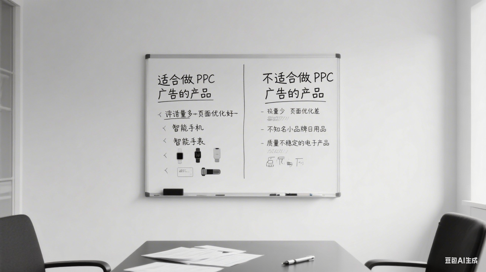

##### 不适合做PPC广告的产品
对于某些产品来说，投放PPC广告不仅不能带来有效的回报，还可能导致无效花费。以下是一些不适合做PPC广告的产品类型。

###### 1. **超低单价的产品**

超低单价产品通常指售价非常低、单件利润微薄的商品。例如，售价在1-5美元之间的产品。对于这类产品，做PPC广告并不经济划算，因为即使广告带来了一定的销量，其广告花费也可能会吞噬掉几乎所有的利润。

-   **原因**：PPC广告的每次点击成本（CPC）往往与市场竞争和关键词的热度相关。在激烈竞争的市场中，CPC可能会接近或超过产品的单价。这意味着即使广告带来了点击，也很难覆盖广告花费，从而导致ACOS过高，最终无法实现盈利。

###### 2. **血海产品**

血海产品是指市场上竞争非常激烈、众多卖家销售同类产品的商品。通常，这类产品的差异化不强，竞争者众多，价格恶性竞争严重。

-   **原因**：在血海市场中，广告投放的效果通常较差，因为无论广告花费多少，卖家都面临着激烈的竞争。即便广告能够带来一定的流量，但由于产品缺乏差异化，转化率也通常较低。高竞争导致的高CPC也会进一步增加广告成本。

###### 3. **转化率超低的产品**

转化率是衡量广告效果的重要指标，转化率低的产品通常无法有效地将点击转化为订单。低转化率的产品往往缺乏足够的吸引力或产品页面的质量较差。

-   **原因**：即使PPC广告能够带来大量的点击，如果转化率非常低，那么广告花费将无法带来足够的回报。转化率低可能是由于产品页面优化差、图片质量低、价格不具竞争力，或者产品本身不符合顾客的需求。

###### 4. **好评量少，页面优化差的产品**

产品的好评数量和质量直接影响其转化率。如果产品的好评数量少，且页面的内容和设计不够吸引顾客，投放PPC广告就可能不会带来显著的效果。

-   **原因**：在亚马逊上，顾客通常会根据产品的评论和评分来决定是否购买。如果产品的评价较少，或者评价不佳，顾客可能会对该产品产生疑虑，导致点击量无法转化为订单。此时，广告的效果就会大打折扣，甚至可能出现广告花费远超实际收益的情况。

###### 5. **利润低的产品**

低利润产品指的是产品售价与成本之间的差距非常小，导致卖家从每一笔销售中赚取的利润较低的商品。

-   **原因**：对于低利润的产品，即便通过PPC广告带来了销量，由于单个产品的利润微薄，广告带来的收入可能无法覆盖广告花费。在这种情况下，即使订单量有所增加，卖家可能也无法获得预期的盈利。

###### 6. **自发货的产品**

自发货的产品是指由卖家自行处理和发货的商品。相比FBA产品，自发货产品通常在配送时效、服务质量等方面较弱，可能会影响顾客的购买决策。

-   **原因**：亚马逊的顾客通常更偏向于选择FBA产品，因为FBA提供更快的配送、更好的客户服务和更高的信任度。自发货产品可能面临配送延误、退货处理等问题，从而降低顾客的转化率。

###### 7. **搜索结果少或者冷门产品**

冷门产品指的是在市场上需求较低、搜索量较少的商品。这类产品在亚马逊上的曝光量较小，往往缺乏流量支持。

-   **原因**：如果一个产品的搜索量非常小，投放PPC广告也无法带来大量的点击和曝光。这使得广告的投放成本很难通过销售额来弥补，导致广告花费无法得到有效回报。