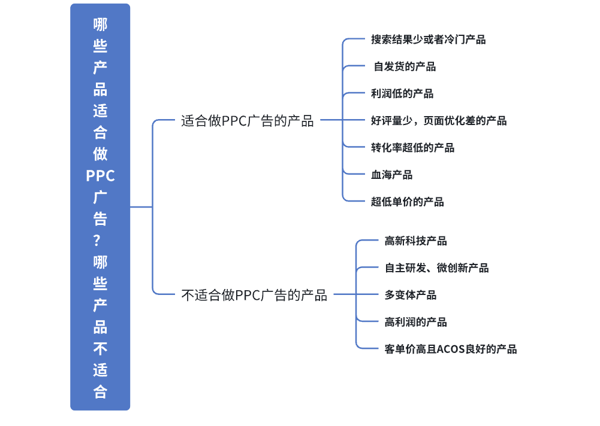

在亚马逊广告投放中，选择合适的产品进行PPC广告是提高广告效益、降低成本的关键。并非所有产品都适合进行PPC广告投放，卖家需要根据产品的特性、市场需求、竞争环境等因素来做出决策。
对于不适合做PPC广告的产品，主要包括以下七类：超低单价产品、竞争激烈的血海产品、转化率极低的产品、好评量少或页面优化差的产品、利润较低的产品、以及自发货产品等。低单价或低利润产品即使通过广告获得流量，其高昂的广告费用可能无法覆盖成本，导致亏损。竞争过于激烈的产品由于广告投入过高，往往难以获得良好的回报，尤其是在同类商品大量存在的市场中。此外，页面质量差、转化率低的产品通常无法通过广告快速带来有效销售，影响广告效果和成本控制。
相对而言，适合做PPC广告的产品通常具备以下特点：高客单价、高利润、多变体产品、独特性强的自主研发产品和高新科技产品等。这些产品由于具备较高的利润空间和较强的市场需求，可以通过PPC广告带来较高的销售额，并且广告的成本能够在可控范围内实现盈利。高客单价和高利润产品尤其适合通过PPC广告投放，因为即使CPC较高，它们仍然能带来较高的投资回报率。此外，具有差异化优势的创新产品往往能够通过精准广告投放获得更好的效果，增加顾客的购买意图。
通过明确哪些产品适合投放PPC广告，卖家可以合理分配广告预算，优化广告投放策略，提高广告的投入回报率，避免不必要的浪费，确保广告活动的成功。